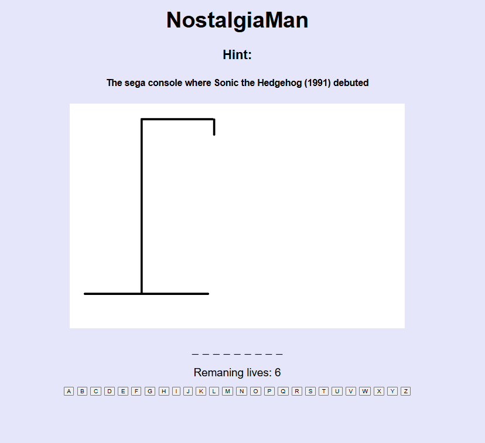

# hangman-project

Introduction

this game was made by me for "project 1" for General assembly. NostalgiaMan is a retro themed hangman game about retro game consoles and ideo game franchises. I felt nostalgic making this game, i hope you feel the same when playing it too!

project brief 

Hangman is a word guessing game in which you have a limited amount of attempts to guess the right letters of the word. once you run out of guesses, you lose.

- Create a working browser game that works on desktops.
- create simple win and loss.conditions that are easy to impliment in code and in the game.
- Only use HTML, CSS and Javascript to create the game.
- The game can be either single player or multiplayer.
- Deploy the game online for eveyone to play and enjoy.

Technologies

- HTML

- CSS

- JavaScript 

Game features

- choosing a word upon game restart

- Hints!
to make things easier for the layer, i've included hints to ensure an easier time for the player to guess the word.

Win conditions
 - ensure that you guess the word with amunt of guesses that you have.

 Loss conditions 

- if you run out of guesses, it is game over.

Conclusion 

This was a fun project to make, even if there were multiple challenges and isues. Overall, i'm satisfied with my game. granted, it could use some more styling. I i had a longer time period, i'd implement style features such as pop ups upon win/loss.

